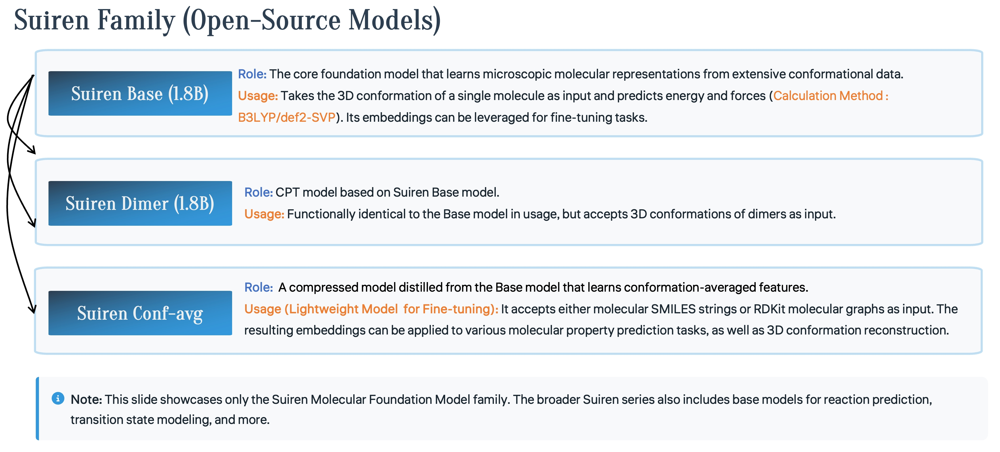

<div align="center" style="line-height:1">
  <a href="https://github.com/Gewu-Intelligence" target="_blank"></a>
  <a href="https://github.com/Gewu-Intelligence/Huntianling"></a>
  <a href="https://drive.google.com/file/d/1vUMYzhmhCeNU18WE5D_xV4gQWxfU7kI7/view?usp=sharing"></a>
</div>

<div align="center" style="line-height: 1;">
  <a href="https://github.com/Gewu-Intelligence/Suiren-Foundation-Model/blob/main/LICENSE"></a>
</div>

# Overview of Suiren Molecular Foundation Model

Suiren Molecular Foundation Model is designed for quantum property prediction and molecular representation learning. This repository provides the model api and checkpoints of Suiren models. Details can be found in [Suiren-1.0 Technical Report](https://arxiv.org/abs/2603.21942v1).

Suiren leverages large-scale pre-training to learn comprehensive molecular representations. The model supports:

- **Energy and Force Prediction**: Accurate quantum property prediction for molecular systems
- **Atomic-level Embeddings**: Equivariant atomic representations for downstream tasks
- **Transfer Learning**: Fine-tuning on custom datasets for specialized applications
- **Domain Continue Pre-Training**: Continue pre-training (CPT) in some specific domains, such as drug molecules and battery molecules. We currently provide the CPT version of Dimer molecules.

## Key Features

- 🚀 **Simple YAML Configuration**: All model configuration information is stored in YAML files.
- 🔧 **Standardized API**: The model classes can be used directly.
- 📊 **Normalization Support**: All normalization constants and atomic reference tables used for training are provided.
- ⚡ **Efficient Inference**: (Coming soon) Fused with fairchem's graph parallel.

<div align="center">

</div>

# Usage

## Installation

Clone the repository and install in development mode:

```bash
git clone https://github.com/Gewu-Intelligence/Suiren-Foundation-Model.git
cd Suiren-Foundation-Model
pip install -e .
```

### Requirements

- Python 3.8+
- PyTorch 2.0+
- numpy
- torch_geometric
- pyg_lib torch_scatter torch_sparse torch_cluster torch_spline_conv
- e3nn
- yaml

## Quick Start

### Step 1: Download the Checkpoint


| Model | Url | Size | Configuration | Description |
|-----|-----|-----|-----| -----|
| Suiren-Base | [Huggingface](https://huggingface.co/ajy112/Suiren-Base) | 7GB | [yaml](config/suiren-base.yml) | The core foundation model encodes quantum chemical knowledge across a diverse spectrum of small molecules and enables direct prediction of quantum chemical properties. |
| Suiren-Dimer | [Huggingface](https://huggingface.co/ajy112/Suiren-Dimer) | 7GB | [yaml](config/suiren-dimer.yml) | A CPT model designed to characterize intermolecular interactions. |
| Suiren-ConfAvg | [Huggingface](https://huggingface.co/ajy112/Suiren-ConfAvg) | 40M | - | Detail and usage can be found in [Suiren-property-prediction](https://github.com/Gewu-Intelligence/Suiren-Property-Prediction). |

### Step 2: Load Model and Weights

```python
import torch
from suiren_models import ModelLoader

# Initialize loader
loader = ModelLoader(config_path='config_name.yml')
# example: loader = ModelLoader(config_path='suiren-base.yml')

# Load model architecture (already consider your device)
model = loader.load_model()

# Load pre-trained weights (load for loader.model)
loader.load_weights('path/to/checkpoint')

# Load normalizer from config
loader.load_normalizer()

# Load normalizer from checkpoint (optional, if you have another normalizer)
#  loader.load_normalizer('path/to/normalizer')
```

### Step 3: Prepare Input Data

**Suiren-Base model can only process non-periodic organic molecules containing the elements (H, C, N, O, F, P, S, Cl, Br, I).**

The data must be converted to torch.tensor format. Each molecule is represented by a 'dict' containing two keys: 'x' and 'pos', representing atomic numbers ('torch.long') and atomic coordinates ('torch.float32') respectively. The dictionaries of all molecules are stored in a 'list', and then processed using loader.data_process(data). (Currently, it is recommended to perform inference molecule by molecule; multiple molecules may lead to OOM.)

```python
# Input data example
atomic_numbers = torch.tensor([6, 1, 1, 1, 1])  # 6=C, 1=H
positions = torch.randn(5, 3)  # 5 atoms with 3D coordinates
data = {"x": atomic_numbers, "pos": positions}
data_list = [data]
processed_data = loader.data_process(data_list)
```

### Step 4: Perform Inference
`loader.inference` includes model forward pass, output denormalization, and atomic reference denormalization. If you want the model to predict the most raw energy and forces (precision: B3LYP/def2-SVP; unit: Kcal/mol, Kcal/mol/A), please keep `denormalize_output=True` and `atom_ref=True`.

```python
# Run inference
processed_data = processed_data.to(device)
with torch.no_grad():
    # output = model(processed_data)
    output = loader.inference(processed_data, denormalize_output=True, atom_ref=True)

# Extract results
energy = output['energy']          # Predicted total energy (kcal/mol)
forces = output['forces']          # Predicted atomic forces (kcal / mol / A)
embeddings = output['node_embeddings']  # Atomic-level embeddings
```

If you only want to use embeddings, you can set `output_module: False` in the YAML file, and the model output only contains `output['node_embeddings']`.


### ModelLoader Class

Main interface for loading and managing the Suiren model.

#### Methods

**`__init__(config_path: str)`**
- Initialize loader with configuration file
- Args: `config_path` - Path to YAML configuration file

**`load_model() -> torch.nn.Module`**
- Load model architecture based on config
- Returns: Initialized model instance

**`load_weights(model: torch.nn.Module, weights_path: str = None) -> torch.nn.Module`**
- Load pre-trained weights into model
- Args:
  - `model` - Model instance to load weights into
  - `weights_path` - Optional path to model weights
- Returns: Model with loaded weights

**`load_normalizer(normalizer_path: str = None) -> dict`**
- Load data normalization parameters
- Priority: `normalizer_path` argument > config file > no normalization
- Args: `normalizer_path` - Optional path to normalizer checkpoint
- Returns: Normalizer parameters dict

**`data_process(input_data: dict) -> torch.Tensor`**
- Process raw input data into model-compatible format
- Args: `input_data` - Dictionary with 'atomic_numbers' and 'positions' keys
- Returns: Processed data tensor

**`__init__(config_path: str)`**
- Initialize ModelLoader with YAML configuration file
- Args: `config_path` - Path to YAML configuration file

**`load_model() -> EST_Eqv2`**
- Load and instantiate the model from configuration
- Returns: Initialized model instance

**`load_weights(weights_path: str) -> EST_Eqv2`**
- Load pre-trained model weights into the loaded model
- Args: `weights_path` - Path to model weights checkpoint file
- Returns: Model with loaded weights

**`load_normalizer(normalizer_path: str = None) -> dict`**
- Load normalization parameters for energy and forces
- Priority: normalizer_path file > config file > raises error if not found
- Args: `normalizer_path` - Optional path to normalizer checkpoint
- Returns: dict with 'energy_mean', 'energy_std', 'forces_mean', 'forces_std', 'atomref_list' keys

**`normalize(values: torch.Tensor, target: str = 'energy', batch: torch.Tensor = None, elements: torch.Tensor = None, atom_ref: bool = False) -> torch.Tensor`**
- Normalize raw values using loaded normalization parameters
- Args:
  - `values` - Tensor values to normalize
  - `target` - Value type: 'energy' or 'forces'
  - `batch` - Batch index tensor (required if atom_ref=True)
  - `elements` - Atomic numbers (required if atom_ref=True)
  - `atom_ref` - Apply atomic reference correction
- Returns: Normalized tensor

**`denormalize(predictions: torch.Tensor, target: str = 'energy', batch: torch.Tensor = None, elements: torch.Tensor = None, atom_ref: bool = False) -> torch.Tensor`**
- Denormalize model predictions using loaded normalization parameters
- Args:
  - `predictions` - Model predictions to denormalize
  - `target` - Prediction type: 'energy' or 'forces'
  - `batch` - Batch index tensor (required if atom_ref=True)
  - `elements` - Atomic numbers (required if atom_ref=True)
  - `atom_ref` - Apply reverse atomic reference correction
- Returns: Denormalized tensor
 
**`data_process(data_list: List[dict]) -> Data`**
- Process raw input data list into PyTorch Geometric Data format
- Args: `data_list` - List of dictionaries with 'x' and 'pos' keys
- Returns: PyTorch Geometric Data object with batched tensors

**`inference(input_data: Data, denormalize_output: bool = False, atom_ref: bool = False) -> dict`**
- Perform inference with the loaded model
- Args:
  - `input_data` - Input data for the model
  - `denormalize_output` - Whether to denormalize energy and forces
  - `atom_ref` - Whether to apply atomic reference correction
- Returns: dict with model outputs ('energy', 'forces', 'embedding', etc.)

## Citation

If you use this framework or Suiren models, please cite the relevant papers for the underlying models.

```
@article{an2026suiren,
  title={Suiren-1.0 Technical Report: A Family of Molecular Foundation Models},
  author={An, Junyi and Lu, Xinyu and Shi, Yun-Fei and Xu, Li-Cheng and Zhang, Nannan and Qu, Chao and Qi, Yuan and Cao, Fenglei},
  journal={arXiv preprint arXiv:2603.21942},
  year={2026}
}
```

## License

See LICENSE file for details.

## Support

For issues, questions, or contributions, please open an issue on GitHub or contact the development team (junyian@gmail.com).
